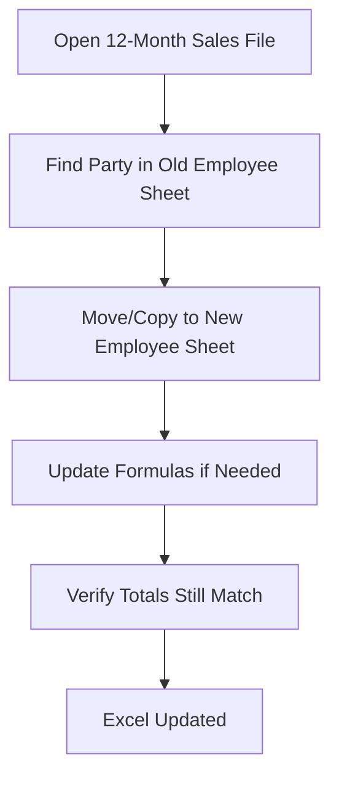

# Changing Party Assigned to MKT Employee

**Translation:** When someone in Marketing leaves, joins, or gets transferred — their dealers/parties need to move with them. This fixes incentives and sales reporting.

---

{/* truncate */}

## Why Do We Even Need This?

Because our incentive system works on **12-month rolling data**, and people don't wait for month-end to quit or join.

## The Problem in Simple Terms:


**Real Impact**: If we don't update this, Employee Y won't get credit for sales, and Employee X (who left) might still show in reports. Chaos ensues.

---

## Step-by-Step Fix Process

**Step 1**: Database Check (The "What's Currently Wrong?" Phase)
First, see what the current mapping looks like:

```sql
-- Find which employee currently owns this party
SELECT *
FROM ACC_MAST T
WHERE T.ACC_CODE = 'PARTY_CODE_HERE'
FOR UPDATE;
```

:::tip
You can use `IN` KEYWORD instead of `=` to select multiple parties like this `('PARTY1', 'PARTY2')`
:::

### What to look for ?

- Is EMP_CODE blank? → **Never assigned**
- Is EMP_CODE wrong? → **Needs correction**
- Does it match the sales file? → **Should match**

:::warning
- Always use **FOR UPDATE** in `SELECT` first (locks the record)
- Never run **UPDATE** without **WHERE** clause (you know why)
- Test in the `TEST SQL ID` first  if not comfortable or doing it for first time.
:::

## Update the 12-Month Sales File (Excel)

The database change alone isn't enough. The **incentive calculation** uses an `Excel` file.



## What to update ?
- Change Names of Old Employee to New
- Check named ranges still work
- Verify sum totals (shouldn't change, just moves between employees)

## Update the file of MKT dept

**Why this matters**: This file is the "single source of truth" for the marketing department. If this is wrong, everything is wrong.

:::info
in the end of the month we compare it with our own file and check if their is no huge difference between incentive points and total sale
:::
