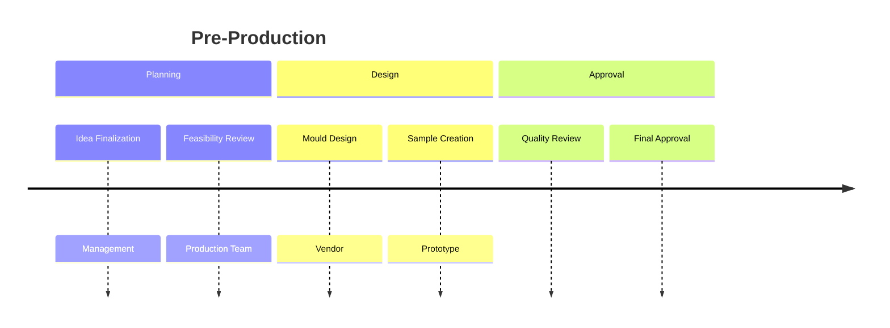
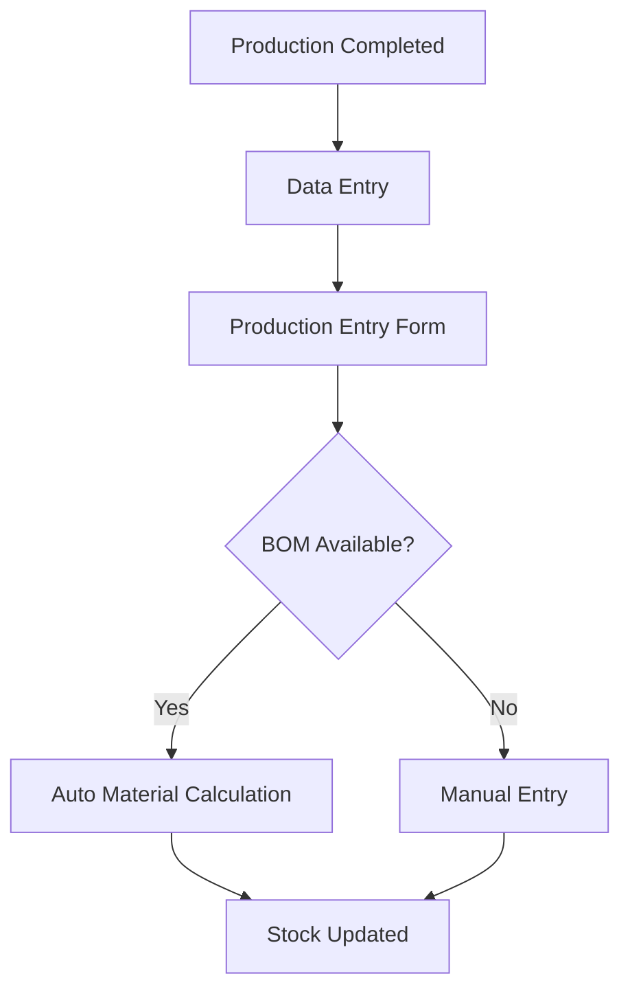
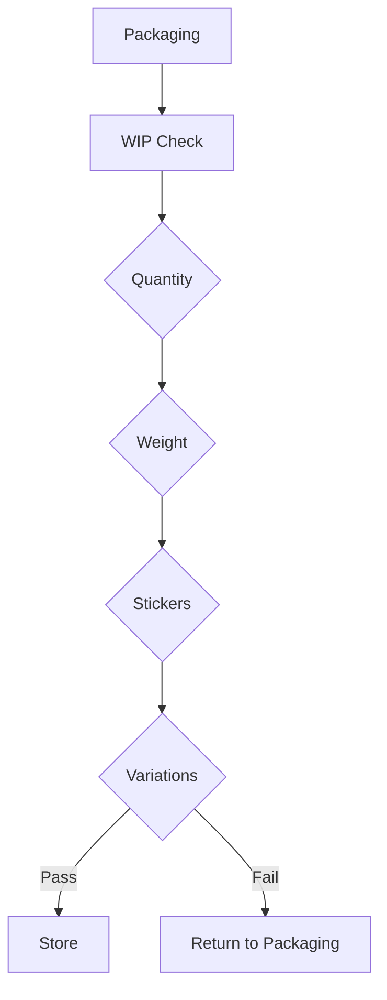
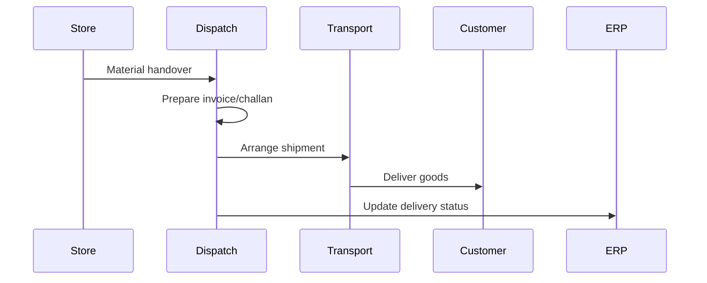

# Production Process (End-to-End)

This page explains how a product moves from an **idea** to a **dispatch-ready item** inside our company.  
This is a high-level flow used by Production, Quality, Costing, Accounts, and Dispatch.

---

{/* truncate */}

## At-a-Glance Overview

## 1. Pre-Production (Product Planning)

This phase defines what to make and how to make it.
No physical production starts before this is complete.

### Key Activities

- Product idea finalized
- Production feasibility discussion
- Director-level approval
- Mould design & sample creation
- Sample review and modifications
- Final approval of product & mould

---

## 2. Production at Plant

Once approved, production starts at the plant.

### Steps
- Moulds are installed on machines
- Production starts as per plan
- Quality Department checks:
  - Product dimensions
  - Finish & appearance
  - Compliance with quality standards
- Branding Department:
  - Clicks product photos
  - Records videos
  - Prepares brochures & marketing material
  - Sends content to dealers

---

## 3. Production Entry & Stock Creation (ERP)

This is where ERP comes into play.

### ERP & Data Entry

### ERP Notes
- **Finished goods** are added to stock
- **BOM (Bill Of Materials)** usage is preferred:
  - Faster entries
  - Consistent consumption
  - Fewer errors

---

## 4. Mould Maintenance & Repairs

Mould issues are common and handled based on **severity**.

### Repair Strategy

- Minor issues → Fixed **in-house**
- Vendor repair only if:
  - Damage is major
  - Quality is impacted
- Goal: **Minimum downtime, maximum control**

---

## 5. Post-Production & Packaging

After production, goods move to packaging and verification.

**WIP Verifies**
- Quantity per batch
- Weight accuracy
- Date & batch stickers
- Product variation inside boxes

---

## 6. Store & Dispatch

**Responsibilities**
- Billing prepares invoice
- Store hands material to Dispatch
- Dispatch ships to dealers/customers
---

## 7. Costing & Accounts (Monthly)
This process runs **parallel** to production.
### Costing
- Calculated monthly
- Includes:
  - Raw material
  - Electricity
  - Maintenance
  - Labour
  - and more
- Cost is **never fixed**

### Accounts
- Verifies costing bills
- Matches ERP and financial data

---

## 8. Pricing & Dealer Margin

Pricing is finalized after cost validation.

**Pricing Principles**
- Company should not incur loss
- Dealer margin must be attractive
- Poor margin = poor sales
Each product has a **unique price** based on its cost structure.

---

## Common FAQs

 

<strong>Why can’t prices be fixed yearly?</strong>

Costs change monthly due to:
- Raw material prices
- Electricity rates
- Labour & overtime
- Maintenance
- Transport & fuel

 

 

<strong>What happens if Quality rejects a batch?</strong>

- **Rework or scrap** decision
- Preventive action implemented

 

 

<strong>How are dealers informed about new products?</strong>

- WhatsApp broadcast
- Email brochures
- Dealer meetings
- ERP notifications
- Physical samples (key dealers)

 

 

<strong>What is mixing ?</strong>

- Mixing is combining different raw materials to create a **base material for production**.
- It ensures uniformity and consistency in the final product.

 

 

<strong>What happens to the products that are rejected or scrap ?</strong>

- Rejected products are moved to the **grinding area**.
- They are then crushed and reused in production as raw material.

 